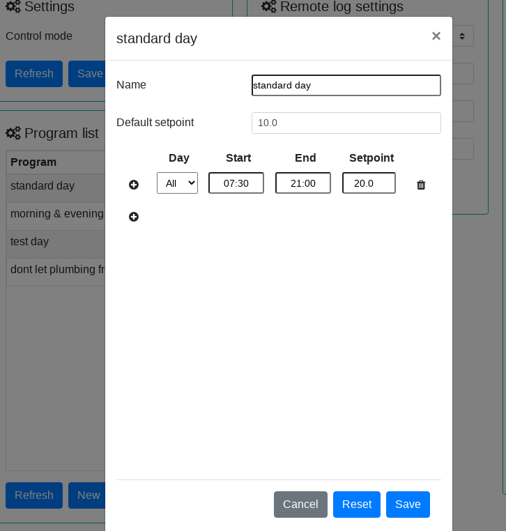

# ESP THERMOSTAT

## Summary

Thermostat app based on [ESPBOT](https://github.com/quackmore/espbot_2.0) and [esp8266-library](https://github.com/quackmore/esp8266-library).

The thermostat APP require a DHT-22 for temperature measurement (on pin D5) and a relay (on pin D2) for controlling an external heater.

The thermostat APP has various working modes:

- OFF
- MANUAL: when working in manual mode the thermostat can keep the heater always ON or can cycle it ON and OFF regardless of the temperature readings.
A 'sleep timer' is available, you can specify how many minutes you want the thermostat to stay in MANUAL mode before going OFF.
- AUTO: when working in auto mode the thermostat will drive the heater trying to reach the temperature setpoint. A PID algorithm is used.
A 'sleep timer' is available, you can specify how many minutes you want the thermostat to stay in AUTO mode before going OFF.
- PROGRAM: a 'program' is a sequence of time intervals specified by 'day of the week', 'start time', 'end time' and 'temperature setpoint'. A default 'temperature setpoint' is also provided to be used when no other setpoint is available. Up to 10 programs can be pre-defined an stored on the device, see 'Configuring and using Programs' later on.

The thermostat APP logs changes in temperature and relative humidity reading, temperature set-point and heater status, and represent all the data graphically.

The thermostat APP can log any change in temperature and relative humidity reading, working mode and heater status to an external host using the following format:

    POST your_path HTTP/1.1
    Host: your_host_ip
    Content-Type: application/json
    Accept: */*
    Connection: keep-alive
    Content-Length: 47
    {"timestamp":1599142201,"type":1,"value":1234}

  event types are:

    1 - temperature reading changed
    2 - heater on/off
    3 - control mode change
    4 - temperature setpoint_change
    5 - relative humidity reading changed

The thermostat APP hosts a web server and can be controlled by a web interface connecting your browser to your_device_IP_address.

## Using the web interface

### Configuring and using Programs

A program must be defined into the section 'PROGRAMS' then it can be used into se section 'CONTROL SETTINGS'.

Interface commands:

- 'RESET' reset the interface requesting the information saved on the device.
All changes that weren't saved are lost.
- 'RENAME' allows to rename the current program
- 'NEW' creates a new program
- 'DELETE' delete current programs
- 'SAVE' save the current program
- '+' button insert a new line before the current one
- 'trash button' remove the current line

#### Programs examples

##### Every day program

This is a simple program that says: for whichever day ('All') keep the temperature close to 20°C between 07:30 and 21:00.
Outside that time interval don't let the temperature go below 10°C.

##### Weekly program

 

This is a more complex program that says:

- on working days ('Mon' to 'Fri') keep the temperature close to 20°C between 06:30 and 08:00 and between 18:00 and 22:00.
- on weekends ('Sat' and 'Sun') keep the temperature close to 20°C between 07:30 and 22:00.
- never let the temperature go below 10°C.

## Building the APP

(build commands are available as VS tasks)

Required:

- [Espressif NON-OS SDK] (<https://github.com/espressif/ESP8266_NONOS_SDK)> in a separate repository.
- [esp-open-sdk toolchain] (<https://github.com/pfalcon/esp-open-sdk)> in a separate repository; build the bare Xtensa toolchain and leave ESP8266 SDK separate using:

      make STANDALONE=n

Build steps (linux)

- Clone the repository.
- Customize build variables according to your ESP8266 module and environment:

      cd <your path>/thermostat
      ./gen_env.sh

      this will generate a env.sh file
      for instance a WEMOS D1 mini file will look like this:
      
      export SDK_DIR=<your path to ESP8266_NONOS_SDK>
      export COMPILE=gcc
      export BOOT=new
      export APP=1
      export SPI_SPEED=40
      export SPI_MODE=DIO
      export SPI_SIZE_MAP=4
      export COMPILE=gcc
      export COMPORT=<your COM port>
      export CC_DIR=<your path to compiler>
      export PATH=$PATH:<your path to compiler>
      export SDK_DIR=<your path to ESP8266_NONOS_SDK>
      export BOOT=new
      export APP=1
      export SPI_SPEED=40
      export FREQDIV=0
      export SPI_MODE=dio
      export MODE=2
      export SPI_SIZE_MAP=6
      export FLASH_SIZE=4096
      export LD_REF=2048
      export FLASH_OPTIONS=" write_flash -fm dio -fs 32m-c1 -ff 40m "
      export FLASH_INIT="0x3FB000 <your path to ESP8266_NONOS_SDK>/bin/blank.bin 0x3FC000 <your path to ESP8266_NONOS_SDK>/bin/esp_init_data_default_v08.bin 0x3FE000 <your path to ESP8266_NONOS_SDK>/blank.bin"

- Building (commands available as tasks in case you are using Visual Studio)
  
  Clean project
  
      source ${workspaceFolder}/env.sh && make clean

  Building current user#.bin

      source ${workspaceFolder}/env.sh && make all

  Building user1.bin
  
      source ${workspaceFolder}/env.sh && make -e APP=1 all

  Building user2.bin
  
      source ${workspaceFolder}/env.sh && make -e APP=2 all

  Building both user1.bin and user2.bin
  
      source ${workspaceFolder}/env.sh && make -e APP=1 all && make -e APP=2 all

## Setup the device

### Flashing

(flash commands are also available as VS tasks)

Flashing ESP8266 using esptool.py (checkout your distribution packages or [github repository](https://github.com/espressif/esptool)) (commands available as tasks in case you are using Visual Studio)
  
  Erase flash
  
      source ${workspaceFolder}/env.sh && make flash_erase

  Flash the bootloader
  
      source ${workspaceFolder}/env.sh && make flash_boot

  Flash init
  
      source ${workspaceFolder}/env.sh && make flash_init

  Flash current user#.bin
  
      source ${workspaceFolder}/env.sh && make flash

  Flash user1.bin
  
      source ${workspaceFolder}/env.sh && make -e APP=1 flash

  Flash user2.bin
  
      source ${workspaceFolder}/env.sh && make -e APP=2 flash

### Wifi setup

- wifi connection: without configuration the ESP device will work as a Wifi AP with SSID=ESPBOT-chip_id and password=espbot123456

      curl --location --request POST 'http://{{host}}/api/wifi/cfg' \
      --data-raw '{
          "station_ssid": "your_Wifi_SSID",
          "station_pwd": "your_Wifi_password"
      }
  this will make the device stop working as AP and connect to your Wifi AP

### Uploading web server files

Use the [espUploadFile](https://github.com/quackmore/esp_utils) bash script to upload files to the ESP8266 device

- cd to web-min (minimized js scripts) directory and upload each file to the device running the following command
- espUploadFile filename 'your device IP address'

### Minimum device configuration

ESP Thermostat requires following minimum configuration (using the web interface)

- cron 'enabled'
- SNTP 'enabled' (for time precision)

## License

The app comes with a [BEER-WARE] license.

Enjoy.
